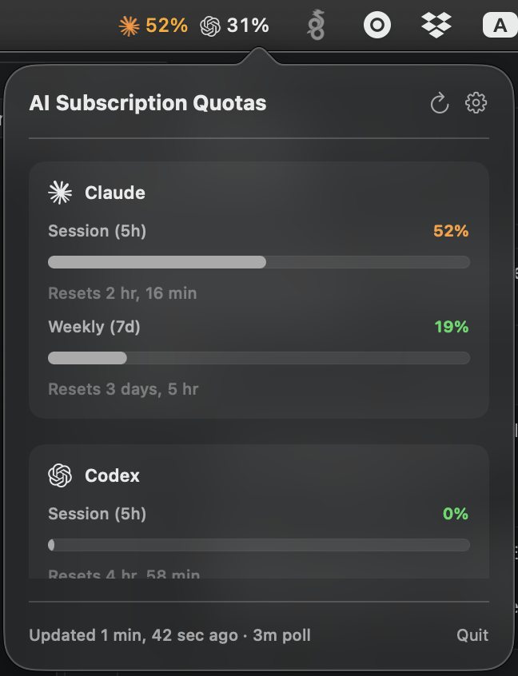
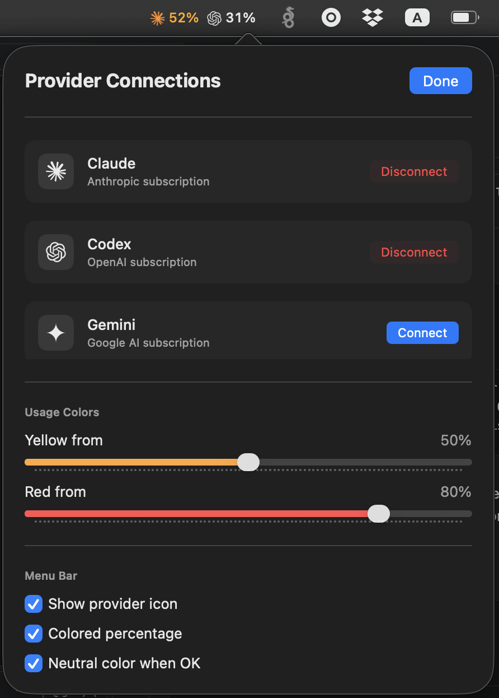

# ClaudeQuota (AIQuota Widget)

macOS menu bar application for monitoring AI subscription usage quotas across multiple providers: **Claude**, **Codex** (OpenAI), and **Antigravity** (Google).

<p align="center">
  
  
</p>

## Features

- **Menu Bar Status**: Each connected provider gets its own real logomark + worst-of-periods utilization percentage (e.g. `max(5h session, 7d weekly)` for Claude), color-coded green/orange/red by configurable thresholds. Icon visibility, coloring, and a "neutral until it needs attention" mode are all toggleable in Settings and persist across restarts.
- **Multi-Provider Monitoring**:
  - **Claude**: 5-hour session quota and 7-day weekly usage limit tracking via Anthropic OAuth API — connects automatically via a localhost OAuth redirect, no copy-pasting.
  - **Codex (OpenAI)**: 5-hour session and weekly rate-limit windows, via the same OAuth flow and usage API the official Codex CLI uses — connects automatically via a localhost OAuth redirect, no copy-pasting.
  - **Antigravity (Google)**: Remaining quota across Claude, Gemini 3 Pro, and Gemini 3 Flash models on the Antigravity Cloud Code backend — connects automatically via a localhost OAuth redirect, no copy-pasting. Gemini CLI support was dropped since Google is deprecating it in favor of Antigravity (`@google/gemini-cli` stops serving API requests June 18, 2026).
- **Default System Browser Auth**: Launch login directly in your default browser (Safari, Chrome, Arc), enabling full support for Google Sign-In, Passkeys, 2FA, and SAML SSO.
- **Secure Storage**: Credentials stored in macOS System Keychain via standard Security framework APIs (`com.claude.quota.widget`).

---

## 📌 Documentation Rule

> **IMPORTANT**: All project documentation, architectural decision records, feature plans, and implementation walkthroughs **MUST** be maintained inside the [`doc/`](doc/) directory (specifically under [`doc/features/`](doc/features/)). 
>
> Please consult [`doc/README.md`](doc/README.md) before making architectural modifications.

---

## Documentation Index

- **[Architecture & Initial Specs](doc/features/initial-architecture.md)**: Data sources, API endpoints, data models, and application layout. *(Historical plan — partially superseded, see note at top of the doc.)*
- **[Default Browser Authorization Flow](doc/features/default-browser-auth.md)**: System browser OAuth flow specification, sheet implementation, and removal of legacy Keychain fallbacks.
- **[Localhost OAuth Redirect Flow](doc/features/oauth-localhost-flow.md)**: Automatic CLI-style loopback OAuth authorization using a local HTTP server on `localhost:54321`.
- **[Popover/Settings Reactivity Fixes](doc/features/popover-reactivity-fixes.md)**: Why connect/disconnect, the OAuth browser round-trip, and Claude's usage periods could get stuck showing stale state, and how each was fixed.
- **[UI Customization](doc/features/ui-customization.md)**: Manual token paste removal, simplified provider names, real logomark icons, configurable usage-color thresholds, and the menu bar's icon/color/neutral settings.
- **[Antigravity Connect Flow](doc/features/antigravity-connect-flow.md)**: Replaced the non-functional Gemini stub with a real localhost OAuth flow and quota fetch against Google's Antigravity/Cloud Code Assist backend.

---

## Building and Running

### Prerequisites
- macOS 14.0 or later
- Swift 5.9+ / Xcode Command Line Tools
- OAuth client credentials in `.env` — copy `.env.example` to `.env` and fill it in (`./scripts/fetch_secrets.sh` automates most of it). See [`doc/features/oauth-credentials.md`](doc/features/oauth-credentials.md).

### Build via Swift Package Manager
```bash
swift build
```

### Build `.app` Bundle
To build a standalone executable application bundle in `build/ClaudeQuota.app` (this also generates the credentials file from `.env` automatically):
```bash
./scripts/build_app.sh
```

### Launch Application
```bash
open build/ClaudeQuota.app
```

### Install to /Applications
```bash
cp -r build/ClaudeQuota.app /Applications/
```

### Launch at Login
1. `System Settings` → `General` → `Login Items & Extensions`.
2. Under "Open at Login", click `+` and add `ClaudeQuota.app` from `/Applications`.

Since the app is ad-hoc signed with a fixed identifier (see `build_app.sh`), re-running `build_app.sh` and copying the new build over `/Applications/ClaudeQuota.app` keeps this Login Items entry and any Keychain "Always Allow" grants intact — no need to re-add it after every rebuild.
